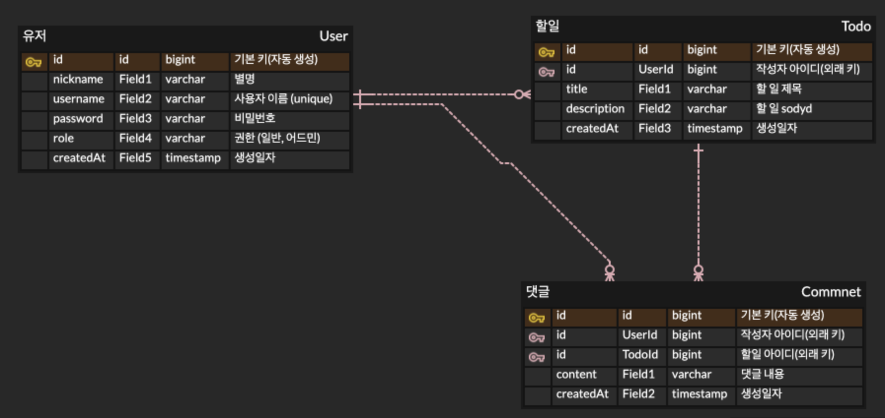

# Todo APP 만들기
회원가입, 로그인 기능이 있는 투두앱 백엔드 서버 만들기

## 학습 목표
1. 회원가입, 로그인을 구현할 수 있어요.
2. 인증/인가를 이해하고 JWT를 활용하여 할일 및 댓글을 처리할 수 있어요.
3. JPA 연관관계를 이해하고 회원과 할일 그리고 댓글을 구현할 수 있어요.
4. 할일을 완료처리하며 상태를 관리 할 수 있어요.

## 설계와 ERD

### 설계 구조
- entity
  - User 
  - Todo 
  - Comment
  - UserRoleEnum 

- controller
  - HomeController 
  - UserController 
  - TodoController 
  - CommentController
  
- service
  - UserService
  - TodoService
  - CommentService

- repository
  - UserRepository
  - TodoRepository
  - CommentRepository
  
- dto
  - LoginRequestDto
  - SignupRequestDto
  - TodoRequestDto 
  - CommentRequestDto
  
### 인증 방식
- jwt
- security

### ERD Diagram

### DTO
- LoginRequestDto
  - username(NotBlank)
  - password(NotBlank)

- SignupRequestDto
  - username(NotBlank)
  - password(NotBlank)
  - nickname(NotBlank)
  - admin(false)
  - adminToken

- TodoRequestDto
  - title(NotBlank)
  - description(NotBlank)
  
- CommentRequestDto
  - content(NotBlank)

### API

| 기능          | Method | URL                                       | request                                                                                                    | response                                   |
| ----------- | ------ | ----------------------------------------- | ---------------------------------------------------------------------------------------------------------- | ------------------------------------------ |
| 로그인 페이지     | GET    | /api / login                              |                                                                                                            |                                            |
| 로그인 요청      | POST   | /api / login                              | {'username': 'username', 'password': 'password'}                                                           | 성공시 : 할일 페이지 랜더링 / 실패시 : 다시 로그인 요청 페이지 랜더링 |
| 회원가입 페이지    | GET    | /api /signup                              |                                                                                                      |                                            |
| 회원가입 요청     | POST   | /api /signup                              | {'username': 'username', 'password': 'password', 'nickname': 'nickname', 'admin': false, 'adminToken': ""} | 회원가입에 대한 성공여부                              |
| 할일 전체 목록 조회 | GET    | /api/todos                                |                                                                                                            | 등록된 전체 할일들의 정보                             |
| 할일 등록 요청    | POST   | /api/todos                                | {'title': 'title', 'description': 'description'}                                                           | 할일 등록에 대한 성공 여부 및 등록된 할일 정보                |
| 할일 상세 조회    | GET    | /api/todos/{todosId}                      |                                                                                                            | 선택한 할일 상세 정보                               |
| 할일 수정 요청    | PUT    | /api/todos/{todosId}                      | {'title': 'title', 'description': 'description'}                                                           | 할일 수정에 대한 성공 여부 및 수정된 할일 정보                |
| 할일  삭제 요청   | DELETE | /api/todos/{todosId}                      |                                                                                                            | 할일 삭제에 대한 성공여부                            |
| 댓글 등록 요청    | POST   | api/todos/{todosId}/comments              | {'content': 'content'}                                                                                     | 댓글 등록에 대한 성공 여부 및 등록된 댓글 정보                |
| 댓글 수정 요청    | PUT    | api/todos/{todosId}/comments/{commentsId} | {'content': 'content'}                                                                                     | 댓글 수정에 대한 성공 여부 및 수정된 댓글의 정보               |
| 댓글 삭제 요청    | DELETE | api/todos/{todosId}/comments/{commentsId} |                                                                                                            | 댓글 삭제에대한 성공 여부                             |

## 구현 기능
- Signup 
  - [ ] 기본적으로는 일반 유저로 요청되고 ,어드민을 선택하면 어드민 계정으로 회원 가입을 할수있다.(어드민 비밀번호을 요구함)
  - [ ] 요청한 정보가 DB에 저장 된다.
  - [ ] 요구되는 정보 입력을 전부 해주지않으면 저장을 막고, 실패 알림을 해준다
  - [ ] 회원가입 성공여부를 알려준다
  - [ ] 회원가입 성공시 로그인 페이지를 렌더링 시킨다.

- Login
  - [ ] 로그인 요청시 해당 정보가 DB에 있는 유저 정보를 확인하여 로그인 성공 여부를 결정 한다.
  - 로그인 성공시 
    - [ ] 로그인 성공 알림을 해준다.
    - [ ] JWT을 Cookie 안에 넣어 반환 해준다.
    - [ ] 할일 페이지를 렌더링 시킨다.
  - 로그인 실패시 
    - [ ] 로그인 실패 알림을 해준다
    - [ ] 다시 로그인 페이지를 렌더링 시킨다.
 
- Todo 
  - [x] 할일을 등록 할 수 있다.
  - [x] 요구되는 정보 입력을 전부 해주지않으면 저장을 막고, 실패 알림을 해준다
  - [x] 등록 성공여부를 알려준다
  - [x] 등록된 전체 할일의 목록들이 조회된다.
    - [x] 할일의 제목의 정보를 보여준다
    - [ ] 할일의 작성자를 보여준다.
    - [x] 할일이 생성된 날짜를 보여준다.
  - [x] 등록된 할일을 누르면 해당되는 할일의 상세 정보가 조회된다
  
- Todo Detail
  - [x] 할일의 제목의 정보를 보여준다
  - [ ] 할일의 작성자를 보여준다.
  - [x] 할일이 생성된 날짜를 보여준다.
  - [x] 할일의 내용을 보여준다.
  - [x] 선택된 할일을 수정을 할 수 있다.(로그인 구현시 작성자만 수정 가능하도록 변경)
  - [x] 수정 성공여부를 알려준다
  - [x] 요구되는 정보 입력을 전부 해주지않으면 수정을 막고, 실패 알림을 해준다
  - [x] 선택한 할일을 삭제를 할 수 있다.(로그인 구현시 작성자만 삭제 가능하도록 변경)
  - [x] 삭제시 확인 알림을 통해 재확인
  - [x] 삭제 성공여부를 알려준다
  - [x] 해당 할일에 등록된 댓글이 조회된다.
  
- Comment
 - [x] 댓글의 내용을 보여준다
 - [ ] 댓글의 작성자를 보여준다.
 - [x] 댓글이 생성된 날짜를 보여준다.
 - [ ] 해당 댓글을 등록한 작성자는 수정을 할 수 있다.
 - [ ] 해당 댓글을 등록한 작성자는 삭제를 할 수 있다.

## 과제 단게별 체크 리스트
- [x] 1단계 - 일정과 댓글의 연관 관계
  - [x] 지난 과제에서 만든 일정에 댓글을 추가할 수 있습니다.
  - [x] ERD에도 댓글 모델을 추가합니다
  - [x] 각 일정에 댓글을 작성할 수 있도록 관련 클래스를 추가하고 연관 관계를 설정합니다
  - [x] 매핑 관계를 설정합니다. (1:1 or N:1 or N:M)

- [x] 2단게 - 댓글 등록
  - [x] 선택한 일정이 있다면 댓글을 등록합니다.
  - [x] 댓글이 등록되었다면 client에게 반환합니다.
  - [x] 댓글을 식별하는 고유번호, 댓글 내용, 댓글을 작성한 사용자 아이디, 댓글이 작성된 일정 아이디, 작성일자를 저장할 수 있습니다.
  - 예외처리
    - [x] 선택한 일정의 ID를 입력 받지 않은 경우
    - [x] 댓글 내용이 비어 있는 경우
    - [x] 일정이 DB에 저장되지 않은 경우
    
- [x] 3단게 - 댓글 수정
  - [x] 선택한 일정의 댓글을 수정합니다. 
  - [x] 댓글이 수정되었다면 수정된 댓글을 반환합니다.
  - [x] 댓글 내용만 수정 가능합니다
  - [x] 선택한 일정과 댓글이 DB에 저장되어 있어야 합니다.
  - 예외처리
    - [x] 선택한 일정이나 댓글의 ID를 입력 받지 않은 경우
    - [x] 일정이나 댓글이 DB에 저장되지 않은 경우
    - [x] 선택한 댓글의 사용자가 현재 사용자와 일치하지 않은 경우

- [x] 4단게 - 댓글 삭제
  - [x] 선택한 일정의 댓글을 삭제합니다.
  - [x] 성공했다는 메시지와 상태 코드 반환하기
  - [x] 선택한 일정과 댓글이 DB에 저장되어 있어야 합니다
  - 예외처리
    - [x] 선택한 일정이나 댓글의 ID를 입력 받지 않은 경우
    - [x] 일정이나 댓글이 DB에 저장되지 않은 경우
    - [x] 선택한 댓글의 사용자가 현재 사용자와 일치하지 않은 경우